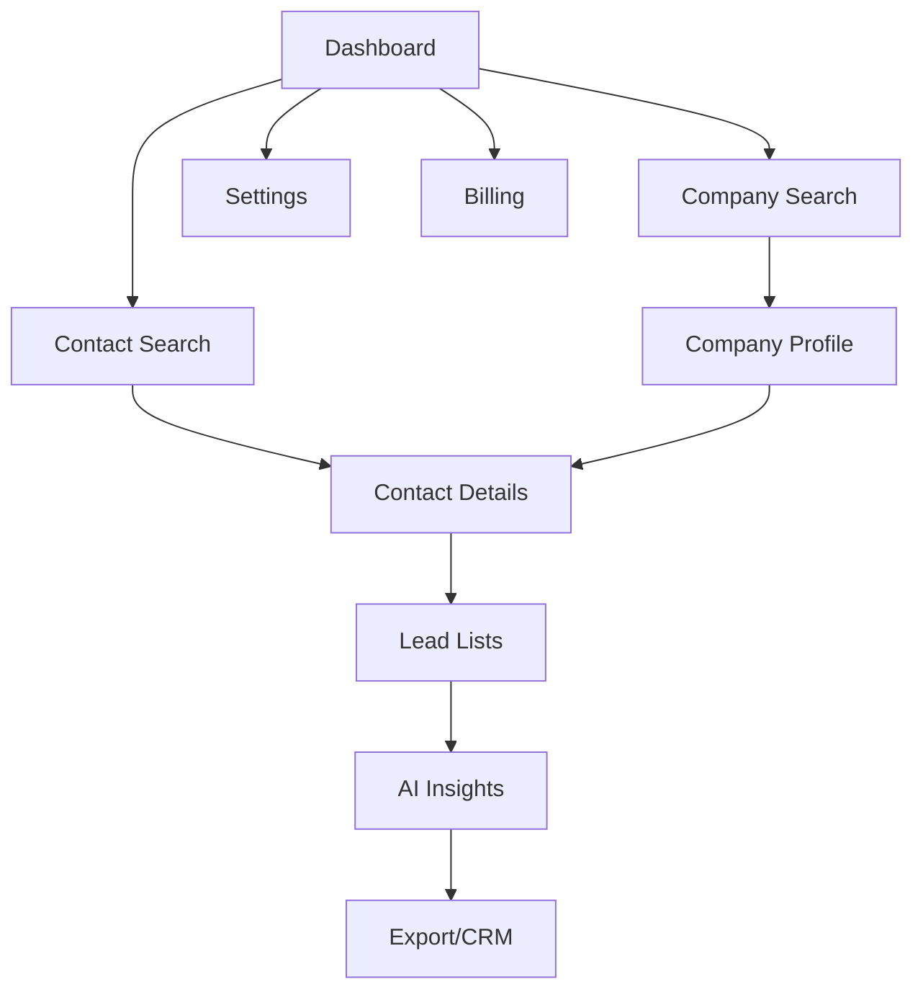

## 1. Product Overview
A comprehensive sales intelligence platform that provides company and contact discovery, lead enrichment, and AI-powered insights. Built for sales teams, marketers, and business development professionals to find, qualify, and engage prospects more effectively.

The platform solves the problem of manual prospect research by aggregating business data, social profiles, and company metrics while providing AI-driven recommendations to improve conversion rates and sales efficiency.

## 2. Core Features

### 2.1 User Roles
| Role | Registration Method | Core Permissions |
|------|---------------------|------------------|
| Free User | Email registration | 50 monthly searches, 10 contact reveals, basic company data |
| Pro User | Credit card upgrade | 500 monthly searches, 100 contact reveals, full contact data, export features |
| Enterprise User | Sales team contact | Unlimited searches, 1000+ reveals, API access, team collaboration |

### 2.2 Feature Module
Our sales intelligence platform consists of the following main pages:
1. **Dashboard**: Search interface, saved searches, recent activity, usage metrics.
2. **Company Search**: Advanced filters, company profiles, employee directory, funding info.
3. **Contact Search**: Contact discovery, email verification, social profiles, job history.
4. **Lead Lists**: Saved prospects, list management, bulk actions, export options.
5. **AI Insights**: Lead scoring, engagement recommendations, industry analysis.
6. **Settings**: Profile management, billing, team settings, API keys.

### 2.3 Page Details
| Page Name | Module Name | Feature description |
|-----------|-------------|---------------------|
| Dashboard | Search Interface | Global search bar with autocomplete for companies and contacts, advanced search toggle, recent searches dropdown. |
| Dashboard | Usage Metrics | Real-time credit counter, search quota display, usage analytics with monthly trends. |
| Dashboard | Saved Searches | Quick access to saved search queries, edit/delete saved searches, search results preview. |
| Company Search | Advanced Filters | Industry, company size, location, funding stage, revenue range, technology stack filters. |
| Company Search | Company Profiles | Company overview, employee count, funding rounds, tech stack, social media links, similar companies. |
| Company Search | Employee Directory | Key decision makers, department breakdown, contact availability indicators, export employee list. |
| Contact Search | Contact Discovery | Name, title, company, location search with email pattern matching and social profile aggregation. |
| Contact Search | Contact Verification | Real-time email validation, phone number verification, social media profile linking. |
| Contact Search | Contact Details | Professional history, current role, contact information, social profiles, engagement history. |
| Lead Lists | List Management | Create/edit/delete lists, bulk add/remove contacts, list sharing with team members. |
| Lead Lists | Export Options | CSV export, CRM integration (Salesforce, HubSpot), API export with rate limiting. |
| AI Insights | Lead Scoring | AI-powered lead quality scoring based on company fit, contact seniority, engagement likelihood. |
| AI Insights | Recommendations | Personalized outreach suggestions, optimal contact timing, messaging templates. |
| Settings | Profile Management | User profile editing, password changes, notification preferences. |
| Settings | Billing | Subscription management, payment method updates, usage history, upgrade/downgrade options. |

## 3. Core Process
### User Flow - Lead Discovery and Engagement
1. User lands on Dashboard and sees search interface with usage metrics
2. User performs company search using filters (industry, size, location)
3. System displays matching companies with key metrics and contact availability
4. User clicks on company to view detailed profile and employee directory
5. User selects target contacts and adds them to lead lists
6. User accesses AI insights for lead scoring and engagement recommendations
7. User exports qualified leads to CRM or downloads as CSV

### Credit-Based Reveal Process
1. User searches for contacts (free)
2. System shows contact preview with blurred details
3. User clicks "Reveal Contact" button
4. System deducts credits and displays full contact information
5. Contact is automatically saved to user's revealed contacts history

## 4. User Interface Design
### 4.1 Design Style
- **Primary Colors**: Deep blue (#1E40AF) for primary actions, emerald (#10B981) for success states
- **Secondary Colors**: Gray slate (#64748B) for text, light gray (#F8FAFC) for backgrounds
- **Button Style**: Rounded corners (8px radius), subtle shadows, hover animations
- **Typography**: Inter font family, 14px base size, clear hierarchy with 600 weight for headers
- **Layout**: Card-based design with consistent spacing, sticky navigation, responsive grid system
- **Icons**: Feather icons library, consistent 20px size, outlined style

### 4.2 Page Design Overview
| Page Name | Module Name | UI Elements |
|-----------|-------------|-------------|
| Dashboard | Search Interface | Centered search bar with 400px width, autocomplete dropdown with company logos, filter pills below search. |
| Dashboard | Usage Metrics | Circular progress indicators for credits, line chart for monthly usage, metric cards with trend indicators. |
| Company Search | Advanced Filters | Collapsible sidebar with checkbox filters, range sliders for size/revenue, multi-select dropdowns for industries. |
| Company Search | Company Profiles | Company cards with logo, 3-column layout showing metrics, funding badges, contact availability indicators. |
| Contact Search | Contact Discovery | Table layout with avatar, name, title, company, location columns, quick action buttons per row. |
| Lead Lists | List Management | Kanban-style board for list organization, drag-and-drop contact cards, bulk selection checkboxes. |
| AI Insights | Lead Scoring | Color-coded score badges (0-100 scale), radar charts for fit analysis, confidence percentage indicators. |

### 4.3 Responsiveness
Desktop-first design approach with mobile adaptation. Breakpoints at 768px (tablet) and 1024px (desktop). Touch-optimized interactions for mobile devices with larger tap targets and swipe gestures for list management.