## 1. Architecture Design


## 2. Technology Description

* **Frontend**: React\@18 + tailwindcss\@3 + vite

* **Initialization Tool**: vite-init

* **Backend**: Node.js\@18 + Express\@4

* **Database**: Supabase (PostgreSQL)

* **Authentication**: Supabase Auth

* **File Storage**: Supabase Storage

## 3. Route Definitions

| Route             | Purpose                                           |
| ----------------- | ------------------------------------------------- |
| /                 | Dashboard with search interface and usage metrics |
| /search/companies | Company search with advanced filters and results  |
| /search/contacts  | Contact discovery and search interface            |
| /companies/:id    | Detailed company profile with employee directory  |
| /contacts/:id     | Individual contact details and engagement history |
| /lists            | Lead list management and organization             |
| /insights         | AI-powered lead scoring and recommendations       |
| /settings         | User profile and account settings                 |
| /billing          | Subscription management and usage history         |
| /api/auth/\*      | Authentication routes handled by Supabase         |

## 4. API Definitions

### 4.1 Core API

#### Company Search

```
GET /api/companies/search
```

Request Parameters:

| Param Name     | Param Type | isRequired | Description                   |
| -------------- | ---------- | ---------- | ----------------------------- |
| query          | string     | false      | Search query for company name |
| industry       | string\[]  | false      | Filter by industry categories |
| size\_min      | number     | false      | Minimum employee count        |
| size\_max      | number     | false      | Maximum employee count        |
| location       | string     | false      | Company location filter       |
| funding\_stage | string\[]  | false      | Funding stage filter          |
| page           | number     | true       | Page number for pagination    |
| limit          | number     | true       | Results per page (max 50)     |

Response:

| Param Name | Param Type | Description                       |
| ---------- | ---------- | --------------------------------- |
| companies  | Company\[] | Array of company objects          |
| total      | number     | Total count of matching companies |
| page       | number     | Current page number               |
| has\_more  | boolean    | Indicates if more results exist   |

#### Contact Reveal

```
POST /api/contacts/reveal
```

Request:

| Param Name  | Param Type | isRequired | Description               |
| ----------- | ---------- | ---------- | ------------------------- |
| contact\_id | string     | true       | Unique contact identifier |

Response:

| Param Name         | Param Type | Description            |
| ------------------ | ---------- | ---------------------- |
| success            | boolean    | Reveal status          |
| contact            | Contact    | Full contact details   |
| credits\_remaining | number     | Updated credit balance |

#### Lead Scoring

```
POST /api/insights/score
```

Request:

| Param Name  | Param Type | isRequired | Description        |
| ----------- | ---------- | ---------- | ------------------ |
| contact\_id | string     | true       | Contact identifier |
| company\_id | string     | true       | Company identifier |

Response:

| Param Name      | Param Type | Description                     |
| --------------- | ---------- | ------------------------------- |
| score           | number     | Lead quality score (0-100)      |
| factors         | object     | Scoring breakdown by category   |
| recommendations | string\[]  | AI-generated action suggestions |

## 5. Server Architecture Diagram


## 6. Data Model

### 6.1 Data Model Definition

```mermaid
erDiagram
    USER ||--o{ SEARCH_HISTORY : creates
    USER ||--o{ REVEALED_CONTACT : reveals
    USER ||--o{ LEAD_LIST : owns
    USER ||--o{ SUBSCRIPTION : has
    COMPANY ||--o{ CONTACT : employs
    COMPANY ||--o{ FUNDING_ROUND : receives
    CONTACT ||--o{ REVEALED_CONTACT : becomes
    LEAD_LIST ||--o{ LIST_CONTACT : contains

    USER {
        uuid id PK
        string email
        string name
        string plan_type
        integer monthly_credits
        integer used_credits
        timestamp created_at
    }
    
    COMPANY {
        uuid id PK
        string name
        string domain
        string industry
        integer employee_count
        string location
        string funding_stage
        json tech_stack
        json social_profiles
        timestamp founded_at
    }
    
    CONTACT {
        uuid id PK
        uuid company_id FK
        string name
        string title
        string email
        string phone
        json social_profiles
        boolean is_verified
        timestamp created_at
    }
    
    REVEALED_CONTACT {
        uuid id PK
        uuid user_id FK
        uuid contact_id FK
        timestamp revealed_at
    }
    
    LEAD_LIST {
        uuid id PK
        uuid user_id FK
        string name
        string description
        boolean is_public
        timestamp created_at
    }
    
    LIST_CONTACT {
        uuid list_id FK
        uuid contact_id FK
        timestamp added_at
    }
    
    SEARCH_HISTORY {
        uuid id PK
        uuid user_id FK
        json search_params
        integer result_count
        timestamp created_at
    }
    
    SUBSCRIPTION {
        uuid id PK
        uuid user_id FK
        string plan_name
        string status
        timestamp current_period_start
        timestamp current_period_end
    }
```



### 6.2 Data Definition Language

#### Users Table

```sql
-- create table
CREATE TABLE users (
    id UUID PRIMARY KEY DEFAULT gen_random_uuid(),
    email VARCHAR(255) UNIQUE NOT NULL,
    name VARCHAR(100) NOT NULL,
    password_hash VARCHAR(255) NOT NULL,
    plan_type VARCHAR(20) DEFAULT 'free' CHECK (plan_type IN ('free', 'pro', 'enterprise')),
    monthly_credits INTEGER DEFAULT 50,
    used_credits INTEGER DEFAULT 0,
    created_at TIMESTAMP WITH TIME ZONE DEFAULT NOW(),
    updated_at TIMESTAMP WITH TIME ZONE DEFAULT NOW()
);

-- create index
CREATE INDEX idx_users_email ON users(email);
CREATE INDEX idx_users_plan ON users(plan_type);
```

#### Companies Table

```sql
-- create table
CREATE TABLE companies (
    id UUID PRIMARY KEY DEFAULT gen_random_uuid(),
    name VARCHAR(255) NOT NULL,
    domain VARCHAR(255) UNIQUE,
    industry VARCHAR(100),
    employee_count INTEGER,
    location VARCHAR(200),
    funding_stage VARCHAR(50),
    tech_stack JSONB,
    social_profiles JSONB,
    founded_at TIMESTAMP,
    created_at TIMESTAMP WITH TIME ZONE DEFAULT NOW(),
    updated_at TIMESTAMP WITH TIME ZONE DEFAULT NOW()
);

-- create index
CREATE INDEX idx_companies_name ON companies(name);
CREATE INDEX idx_companies_industry ON companies(industry);
CREATE INDEX idx_companies_employee_count ON companies(employee_count);
```

#### Contacts Table

```sql
-- create table
CREATE TABLE contacts (
    id UUID PRIMARY KEY DEFAULT gen_random_uuid(),
    company_id UUID REFERENCES companies(id),
    name VARCHAR(255) NOT NULL,
    title VARCHAR(255),
    email VARCHAR(255),
    phone VARCHAR(50),
    social_profiles JSONB,
    is_verified BOOLEAN DEFAULT false,
    created_at TIMESTAMP WITH TIME ZONE DEFAULT NOW(),
    updated_at TIMESTAMP WITH TIME ZONE DEFAULT NOW()
);

-- create index
CREATE INDEX idx_contacts_company ON contacts(company_id);
CREATE INDEX idx_contacts_email ON contacts(email);
CREATE INDEX idx_contacts_verified ON contacts(is_verified);
```

#### Revealed Contacts Table

```sql
-- create table
CREATE TABLE revealed_contacts (
    id UUID PRIMARY KEY DEFAULT gen_random_uuid(),
    user_id UUID REFERENCES users(id),
    contact_id UUID REFERENCES contacts(id),
    revealed_at TIMESTAMP WITH TIME ZONE DEFAULT NOW(),
    UNIQUE(user_id, contact_id)
);

-- create index
CREATE INDEX idx_revealed_user ON revealed_contacts(user_id);
CREATE INDEX idx_revealed_contact ON revealed_contacts(contact_id);
```

#### Lead Lists Table

```sql
-- create table
CREATE TABLE lead_lists (
    id UUID PRIMARY KEY DEFAULT gen_random_uuid(),
    user_id UUID REFERENCES users(id),
    name VARCHAR(255) NOT NULL,
    description TEXT,
    is_public BOOLEAN DEFAULT false,
    created_at TIMESTAMP WITH TIME ZONE DEFAULT NOW(),
    updated_at TIMESTAMP WITH TIME ZONE DEFAULT NOW()
);

-- create index
CREATE INDEX idx_lists_user ON lead_lists(user_id);
```

#### Supabase Row Level Security Policies

```sql
-- Grant basic access to anon role
GRANT SELECT ON companies TO anon;
GRANT SELECT ON contacts(email, name, title, company_id) TO anon;

-- Grant full access to authenticated users
GRANT ALL PRIVILEGES ON ALL TABLES TO authenticated;

-- Row Level Security for users (users can only see their own data)
ALTER TABLE users ENABLE ROW LEVEL SECURITY;
CREATE POLICY "Users can view own profile" ON users FOR SELECT USING (auth.uid() = id);
CREATE POLICY "Users can update own profile" ON users FOR UPDATE USING (auth.uid() = id);

-- Row Level Security for revealed contacts
ALTER TABLE revealed_contacts ENABLE ROW LEVEL SECURITY;
CREATE POLICY "Users can view own revealed contacts" ON revealed_contacts FOR SELECT USING (auth.uid() = user_id);
CREATE POLICY "Users can create revealed contacts" ON revealed_contacts FOR INSERT WITH CHECK (auth.uid() = user_id);

-- Row Level Security for lead lists
ALTER TABLE lead_lists ENABLE ROW LEVEL SECURITY;
CREATE POLICY "Users can manage own lists" ON lead_lists FOR ALL USING (auth.uid() = user_id);
CREATE POLICY "Public lists are viewable" ON lead_lists FOR SELECT USING (is_public = true);
```

